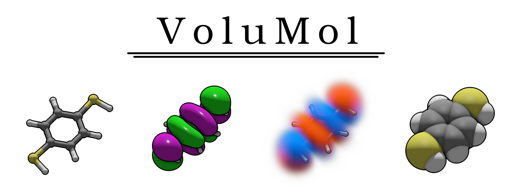

# VoluMol
A simple program for rendering molecules and molecular orbitals written in C++ and GLSL using OpenGL.



# Installation

- Download the files from this repo.
- Download the GLFW source code (ideally the latest version, but currently 3.4 is used), rename the folder to glfw and move it to your VoluMol directory.
- Install CMake if you haven't already.
- Compile the program by typing `cmake .` and `make` in the console. GLFW likes to cause problems with Wayland, but it should be fine if your drivers, OS and GLFW installation are up to date.
- If you have successfully compiled the `.so`/`.dll` file, you can write a test script to open and close the window. If nothing bad happens, your installation is probably working at this point.

# Usage

VoluMol uses Python for scripting. Note that `conda` tends to create a lot of problems in general, so you should disable it using `conda deactivate` before running scripts. To use VoluMol with Python, simply use: 
```python
import <path>.volumol as volumol
```
You can then call all functions of the program like:
```python
volumol.createWindow()
```
3D vectors and colors are represented with tuples of three. A comprehensive list of all features follows. Note that even though the interface technically exposes additional functions and variables, you should not touch these.

## Classes

### `Settings`
Controls the functions of the program. Some settings take effect at all times, other affect generation steps, like molecule mesh generation (MMG), cubemap generation (CG) and isosurface generation (IG). In this case, `updateSettings()` must be called *before* the generation step. Most default values are reasonable, but you will need to change them if you want to achieve certain effects. It can also make sense to lower visual quality for preview purposes and increase fidelity for renders.
|Name|Type|Description|Default|
|-|-|-|-|
|`size_factor`|`float`| MMG: Controls the displayed size of atoms. This size is set to `size_factor` multiplied by the Van-der-Waals radius of the atom. |`0.2`|
|`bond_thickness`|`float`| MMG: Controls displayed bond thickness. This should not be bigger than `size_factor`. |`0.2`|
|`bond_length_tolerance`|`float`| MMG: Controls how bonds are assigned. Bonds are created based on the covalent radii of participating atoms. This tolerance controls how much further apart than the sum of their covalent radii can be and still be treated as bonded. A value of `0.5` would correspond to a 50% tolerance. |`0.3`|
|`fov`|`float`| Field of view of the camera in degress. If `orthographic` is set to `True`, this controls the width of the view in Angstroms instead. |`70.`|
|`outline_radius`|`float`| Controls how thick cartoon-like outlines are drawn around solid objects. If set to `0`, outlines are disabled. |`2.`|
|`ao_intensity`|`float`| Controls the intensity of ambient occlusion (which makes creases appear darker). A value of `0` disables AO, which improves performance. |`1.`|
|`ao_radius`|`float`| The radius of the ambient occlusion kernel in Angstroms. |`0.5`|
|`ao_exponent`|`float`| Controls the look of the AO effect. Higher values result in darker shadows. |`2.`|
|`cubemap_clearence`|`float`| CG: Controls how much space from the fringes of your molecule the cubemap should leave during. Especially for volumetrics you may need to increase this for some orbitals. |`4.`|
|`cubemap_density`|`float`| CG: How densely samples in your cubemap should be distributed. This drastically affects performance when dealing with cubemaps. Calling `setCubemapResolution()` with a non-zero resolution overrides this. If `setCubemapResolution(0)` is called, `cubemap_density` will come back into effect. |`8.`|
|`volumetric_light_distance`|`float`| How far rays are cast during volumetrics rendering for shading. Higher values improve visual quality, but also require higher sample counts which adversely affects performance. |`3.`|
|`volumetric_cutoff`|`float`| Affects at which density values the volumetrics shader will skip samples. Low values decrease performance, high values affect visual quality. |`0.00001`|
|`isovalue`|`float`| IG: The isovalue for rendering isosurfaces, assuming atomic units. |`0.02`
|`isosurface roughness`|`float`| IG: The roughness of the isosurface material, between `0` and `1`. Lower values mean shinier isosurfaces. |`0.5`|
|`isosurface metallicity`|`float`| IG: The amount of metallic shading of the isosurface material. Normally this should be set to `0` or `1`. |`0.`|
|`volumetric_density`|`float`| Controls the density of volumetric MOs. |`50.`
|`brightness`|`float`| Controls how much the image is brightened during post processing. Beware that values beyond `1.` can cause colors to exceed the screen's range and clip. |`1.`|
|`z_near`|`float`| Camera near clipping plane. Small values mean you can get closer to objects before they clip, but also decrease depth resolution. |`0.3`|
|`z_far`|`float`| Camera far clipping plane. This essentially controls how far you can see, but very large values decrease depth resolution. |`300.`|
|`volumetric_gradient`|`float`| Effective only if `volumetric_color_mode = True` and controls the color gradient. Higher values mean the color changes more strongly with increasing function values.|`1.`|
|`ambient_color`|`tuple`| RGB values for ambient light color. Higher values mean shadows will be weaker. |`(0.4, 0.4, 0.4)`|
|`sun_color`|`tuple`| RGB values of the sun's color. Values can exceed `1.` due to tone mapping. |`(2., 2., 2.)`|
|`sun_position`|`tuple`| Vector describing the position of the sun in the "sky". Need not be normalized. |`(2., 1., 1.)`|
|`mo_color_0`|`tuple`| RGB values for MO colors where function values are positive. |`(1., 0.25, 0.)`|
|`mo_color_1`|`tuple`| RGB values for MO colors where function values are negative. |`(0., 0.4, 1.)`|
|`clear_color`|`tuple`| RGB values for the color of the background. This is not subjected to gamma correction and tone mapping like the rest of the scene. Normally, black (`(0, 0, 0)`) or white (`(1, 1, 1)`) backgrounds are sensible. |`(1., 1., 1.)`|
|`sphere_subdivisions`|`int`| MMG: Controls the quality of spheres for displaying atoms. Normally, the default value doesn't cause performance problems but it could for very large molecules. |`3`|
|`cylinder_resolution`|`int`| MMG: Controls the quality of cylinders for displaying bonds. Normally, the default value doesn't cause performance problems but it could for very large molecules. |`32`|
|`volumetric_iterations`|`int`| Controls the number of raycasting steps for volumetrics. This is the main variable that impacts visual quality and performance of volumetrics. |`100`|
|`volumetric_light_iterations`|`int`| Controls the number of raycasting steps for shading with volumetrics. This also has a big impact on performance and visual quality. |`5`|
|`taa_quality`|`int`| Antialiasing quality. This quite strongly affects performance and should really only be used for final renders. A value of `1` means no effective antialiasing, whereas `2` to `4` should give decent results. Higher values can result in banding. This effect also improves the quality of some other effects like ambient occlusion and outlines. |`1`|
|`cubemap_thread_count`|`int`| CG: Controls how many CPU threads are used to render cubemaps when use of the GPU is disabled. |`8`|
|`ao_iterations`|`int`| Iterations used for ambient occlusion. This affects both performance and visual quality. |`16`|
|`smooth_bonds`|`bool`| MMG: When set to `True`, bonds are drawn with smooth color gradients between atoms. |`False`|
|`premultiply_color`|`bool`| Should color be premultiplied before blending onto the background? This should be set to `True` for white backgrounds due to clipping and `False` for black backgrounds. Only effective if `emissive_volume = False`. |`True`|
|`cubemap_use_gpu`|`bool`| CG: Use the GPU to render cubemaps. There is not really a downside to enabling this, but a huge performance downside to disabling. Just keep this as `True`. |`True`|
|`orthographic`|`bool`| Use orthographic projection for the camera. Note that it is a little tricky to control because you can't get a sense of depth, but things still clip in and out of existence at the near and far plane. |`False`|
|`volumetric_shadowmap`|`bool`| Controls wether or not the ball-stick model and isosurfaces should cast a shadow on volumes. This has a slightly negative performance impact.|`True`|
|`emissive_volume`|`bool`| When set to `True`, an emissive volume is used for volumetrics (looks a bit like plasma). When set to `False`, a scatter volume (looks more like clouds/smoke) is used instead. The emissive volume is computationally much cheaper.|`False`|
|`volumetric_color_mode`|`bool`| Controls how colors for volumetrics are calculated. When set to `False`, MOs are colored based on sign, whereas when set to `True`, `mo_color_0` and `mo_color_1` are mixed based on function values. The mixing can be controlled with `volumetric_gradient`. |`False`|


### `MOInfo`
- Contains information about orbitals.
- `energy` Energy value of the orbital (in Hartree).
- `name` Name, usually describing symmetry of the orbital.
- `occupation` Occupation number. Usually ranges from `0` to `2`, but negative values can be used to calculate unpaired spin densities.
- `spin` Spin of the orbital


### `Atom`
- Describes an atom with a charge number `Z` and a `position`, a tuple of three coordinates.


## Constants
`SPIN_UP` and `SPIN_DOWN` are used for the `spin` member of `MOInfo`.


## Functions
### `createWindow()`
Opens a window and initializes VoluMol. After this is called, `dispose()` must be called once all operations are complete.


### `createContext()`
Serves as an alternative to `createWindow` without opening a visible window. `dispose()` must be called once all operations are complete.


### `closeWindow()`
Forces the window to close.


### `dipose()`
Destroys the GLFW context and all allocated OpenGL objects.


### `loadMoldenFile(path)`
Loads a Molden file. This envolves loading both XYZ and orbital data.
- `path` Relative path to the file including its name.


### `loadWFXFile(path)`
Loads a .wfx file. This envolves loading both XYZ and orbital data. This is slightly experimental.
- `path` Relative path to the file including its name.


### `loadXYZFile(path)`
Loads a XYZ file and disables previous isosurfaces/volumetrics.
- `path` Relative path to the file including its name.


### `getAtom(id)`
Returns an atom corresponding to the provided `id`. Some file formats assign IDs to atoms which should be used here. Otherwise, atoms are labeled `0`, `1`, ... by the order in which they appear in the respective file.


### `setTransform(atom0, atom1, atom2, pos0, dir1, dir2)`
Transforms the molecule in space so that three atoms lie in a specified plane.
- `atom0`, `atom1`, `atom2`: IDs of the three atoms to reference.
- `pos0`: Tuple describing the position of `atom0` after the transformation.
- `dir1`: `atom0` and `atom1` will lie on a ray originating at `pos0` and pointing in the direction `dir1`.
- `dir2`: `atom0` and `atom2` will lie on a ray originating at `pos0` and pointing (roughly, the true vector will be orthogonalized) in the direction `dir2`.

Example:\
A water molecule with atoms: 0 - Hydrogen, 1 - Oxygen, 2 - Hydrogen.\
Say we want to transform this molecule so it lies on the XY plane and the hydrogen atoms are aligned with the x-axis. We can achieve this using:
```python
setTransform(0, 2, 1, (0, 0, 0), (1, 0, 0), (0, 1, 0))
```


### `MOCount()`
The number of loaded MOs.


### `getLUMO()`
Returns the index of the LUMO (or rather, the lowest orbital with an occupation of less than `1`). In the closed-shell case, this means the HOMO is `getLUMO() - 1`.


### `getMOInfo(orbital)`
Returns a `MOInfo` object for the corresponding MO index `orbital`.


### `setMOOccupation(orbital, occupation)`
Set the occupation of the MO with index `orbital` to `occupation`. This may be useful for unpaired spin density calculations.


### `setCubemapResolution(resolution)`
Set the number of sample points in the cubemap along all three cardinal directions to `resolution`.


### `MOCubemap(orbital)`
Render a cubemap for the MO with index `orbital`.


### `densityCubemap()`
Render a cubemao for the electron density. This is a very expensive operation.


### `setIsosurface()`
Generate an isosurface mesh from a previously generated cubemap.


### `setVolumetric()`
Use a previously generated cubemap to render a volumetric representation.


### `setCameraOrientation(position, direction)`
Position the camera at `position` and point it towards `direction`.


### `getCameraOrientation()`
Returns two tuples, the first being the cameras position, the second being the direction it is pointing.


### `setElementProperties(Z, color, roughness, metallicity)`
Although VoluMol comes with a default color scheme for the elements, you can use this function to change these materials.
- `Z` Is the charge number of the element.
- `color` Is a tuple describing the element's color.
- `roughness` Describes how rough the material is. Lower values mean shinier materials. Range is between `0` and `1`.
- `metallicity` Controls how metallic the material is. Range is between `0` and `1`.


### `updateSettings(settings)`
Use a `Settings` object to update the program's settings.


### `launchInterface()`
Start an interactive interface to inspect your molecules. `WASD` for movement, `Left Shift` to fly up, `Ctrl` to fly down, right mouse button to turn the camera.


### `saveImage(path, width, height)`
Render an image to a file.
- `path` Relative path to the file including its name.
- `width` Width of the image in pixels.
- `height` Height of the image in pixels.
