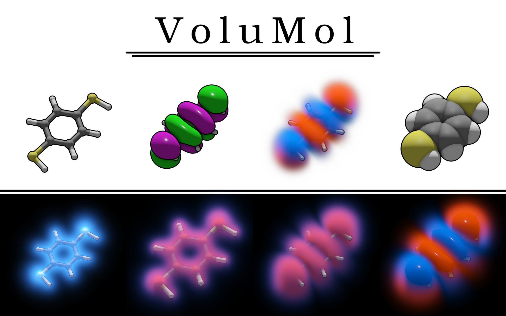

# VoluMol
A simple program for rendering molecules and molecular orbitals using OpenGL.



# Installation

- Download the files from this repo.
- Download the GLFW source code (ideally the latest version, but currently 3.4 is used), rename the folder to glfw and move it to your VoluMol directory.
- Install CMake if you haven't already.
- Compile the program by typing `cmake .` and `make` in the console. GLFW likes to cause problems with Wayland, but it should be fine if your drivers, OS and GLFW installation are up to date.
- If you have successfully compiled the `.so`/`.dll` file, you can write a test script to open and close the window. If nothing bad happens, your installation is probably working at this point.
IMPORTANT NOTE: Currently, the Python interface is hardcoded to assume you have a `.so` file. This means if you are on Windows, you should change the file ending in line 7 of `volumol.py`. I am planning to fix this.

# Usage

VoluMol uses Python for scripting. Note that `conda` tends to create a lot of problems in general, so you should disable it using `conda deactivate` before running scripts. To use VoluMol with Python, simply use ```python from <path> import volumol```.
